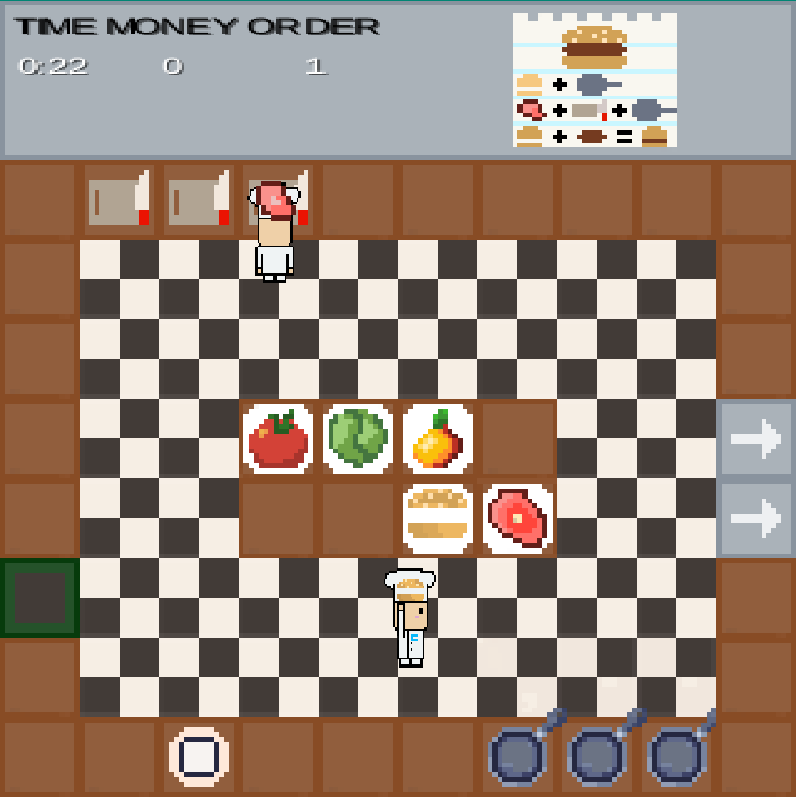

  

  <h1 align="center">Piazza Panic</h1>

  

    A LibGDX game for ENG1
     
    <a href="https://github.com/team13eng1/piazza-panic"><strong>Explore the docs »</strong></a>
     
     
    <a href="https://team13eng1.github.io/">View Website</a>
  

<h3 align="center">Information Documents</h3>

  <a href="./files/info/brief.md"><strong> brief.md </strong></a>
  •
  <a href="./files/info/eng1-team-assessment-1.pdf"><strong> assessment.pdf </strong></a>

<h1 align="center">Assessment 1 Files</h1>

<h3 align="center">Version Control Repository</h3>

  <a href="https://github.com/team13eng1/piazza-panic"><strong>github.com</strong></a>

<h3 align="center">Website</h3>

  <a href="https://team13eng1.github.io/"><strong>this</strong></a>

<h3 align="center">Requirements</h3>

  <a href="./files/assessment/Requirements v2.pdf"><strong>Requirements v2</strong></a>

<h3 align="center">Architecture</h3>

  <a href="./files/assessment/Architecture V2.pdf"><strong> Architecture v2 </strong></a>
  •
  <a href="./files/assessment/Sequence Diagram v1.pdf"><strong> Sequence Diagram v1 </strong></a>
  •
  <a href="./files/assessment/Sequence Diagram v2.pdf"><strong> Sequence Diagram v2 </strong></a>
  •
  <a href="./files/assessment/Sequence Diagram v3.pdf"><strong> Sequence Diagram v3 </strong></a>
  •
  <a href="./files/assessment/State Diagram v1.pdf"><strong> State Diagram v1 </strong></a>
  •
  <a href="./files/assessment/State Diagram v2.pdf"><strong> State Diagram v2 </strong></a>
  •
  <a href="./files/assessment/Use Case Diagram v1.pdf"><strong> Use Case Diagram v1 </strong></a>
  •
  <a href="./files/assessment/Use Case Diagram v2.pdf"><strong> Use Case Diagram v2 </strong></a>
  •
  <a href="./files/assessment/Component Diagram v1.pdf"><strong> Component Diagram v1 </strong></a>
  •
  <a href="./files/assessment/Component Diagram v2.pdf"><strong> Component Diagram v2 </strong></a>
  •
  <a href="./files/assessment/All Attributes in chef.pdf"><strong> All Attributes in chef </strong></a>
  •
  <a href="./files/assessment/All Attributes in playScreen.pdf"><strong> All Attributes in playScreen </strong></a>
  •
  <a href="./files/assessment/Chef Class Diagram.pdf"><strong> Chef Class Diagram </strong></a>
  •
  <a href="./files/assessment/Order Class Diagram.pdf"><strong> Order Class Diagram </strong></a>
  •
  <a href="./files/assessment/Ingredients Class Diagram.pdf"><strong> Ingredients Class Diagram </strong></a>
  •
  <a href="./files/assessment/HUD Class Diagram.pdf"><strong> HUD Class Diagram </strong></a>
  •
  <a href="./files/assessment/Sprites Class Diagram.pdf"><strong> Sprites Class Diagram </strong></a>

<h3 align="center">Method Selection and Planning</h3>

  <a href="./files/assessment/Method Selection and Planning.pdf"><strong> Method Selection and Planning </strong></a>
  •
  <a href="GANTT"><strong> Gantt Charts </strong></a>

<h3 align="center">Risk Assessment and Mitigation</h3>

  <a href="./files/assessment/Risk Assessment and Mitigation v2.pdf"><strong>Risk Assessment and Mitigation</strong></a>

<h3 align="center">Implementation</h3>

  <a href="./files/assessment/Piazza Panic.jar" download><strong> Piazza Panic.jar </strong></a>
  •
  <a href="./files/assessment/piazza-panic-main (1).zip" download><strong> Implementation Part A </strong></a>
  •
  <a href="./files/assessment/Implementation Part B.pdf"><strong> Implementation Part B </strong></a>

<h1 align="center">Assessment 2 Files</h1>

<h3 align="center">Version Control Repository</h3>

  <a href="https://github.com/Lucky13dev/PiazzaPanic"><strong>github.com</strong></a>

<h3 align="center">Website</h3>

  <a href="https://lucky13dev.github.io/"><strong>this</strong></a>

<h3 align="center">Change report</h3>

  <a href="./files/assessment2/Change2.pdf"><strong>Change2.pdf</strong></a>

<h4 align="center">Requirements</h4>

  <a href="./files/assessment2/Req2.pdf"><strong>Req2.pdf</strong></a>

<h4 align="center">Architecture</h4>

  <a href="./files/assessment2/Arch2.pdf"><strong>Arch2.pdf</strong></a>
  •
  <a href="./files/assessment2/IngredientsClass.png"><strong>Ingredients class diagram</strong></a>
  •
  <a href="./files/assessment2/SpriteClass.png"><strong>Sprite class diagram</strong></a>
  •
  <a href="./files/assessment2/RecipeOrderClass.png"><strong>Recipe/Order class diagram</strong></a>
  •
  <a href="./files/assessment2/GameClass.png"><strong>Game class diagram</strong></a>
  •
  <a href="./files/assessment2/Sequence.png"><strong>Sequence diagram</strong></a>
  •
  <a href="./files/assessment2/UseCase.png"><strong>Use case diagram</strong></a>

<h4 align="center">Method selection and planning</h4>

  <a href="./files/assessment2/Plan2.pdf"><strong>Plan2.pdf</strong></a>
  •
  <a href="./files/assessment2/InitialGantt.png"><strong>Initial Gantt chart</strong></a>
  •
  <a href="./files/assessment2/FinalGantt.png"><strong>Final Gantt chart</strong></a>

<h4 align="center">Risk assessment and mitigation</h4>

  <a href="./files/assessment2/Risk2.pdf"><strong>Risk2.pdf</strong></a>

<h3 align="center">Implementation</h3>

  <a href="./files/assessment2/Impl2.pdf"><strong>Impl2.pdf</strong></a>
  •
  <a href="./files/assessment2/PiazzaPanic.zip"><strong>ZIP file</strong></a>
  •
  <a href="./files/assessment2/PiazzaPanic.jar"><strong>JAR</strong></a>

<h3 align="center">Software testing report</h3>

  <a href="./files/assessment2/Test2.pdf"><strong>Test2.pdf</strong></a>
  •
  <a href="./files/assessment2/Test_Results-20230503T080513Z-001.zip"><strong>Test results</strong></a>
  •
  <a href="./files/assessment2/Coverage-20230503T080515Z-001.zip"><strong>Coverage</strong></a>

<h3 align="center">Continuous integration report</h3>

  <a href="./files/assessment2/CI2.pdf"><strong>CI2.pdf</strong></a>

